# workOut 技术架构与流程

| 项 | 内容 |
| --- | --- |
| 产品名称 | workOut |
| 文档类型 | 技术架构 |
| 文档版本 | v1.4 |
| 日期 | 2026-08-18 |
| 依据 | [workOut-产品文档.md](./workOut-产品文档.md)、[workOut-功能文档.md](./workOut-功能文档.md)、`README.md` |
| 实现规格 | OpenSpec [`init-workout-mvp`](../openspec/changes/init-workout-mvp/design.md)、[`phase-6-share-export-demo`](../openspec/changes/phase-6-share-export-demo/) |

---

## 1. 总体技术架构

单体、前后端不分离：React 构建产物由 Spring Boot 静态资源托管；业务 API 同进程提供；数据落 MySQL。鉴权采用 **JWT**；业务数据按 `userId` 隔离。无微服务拆分。

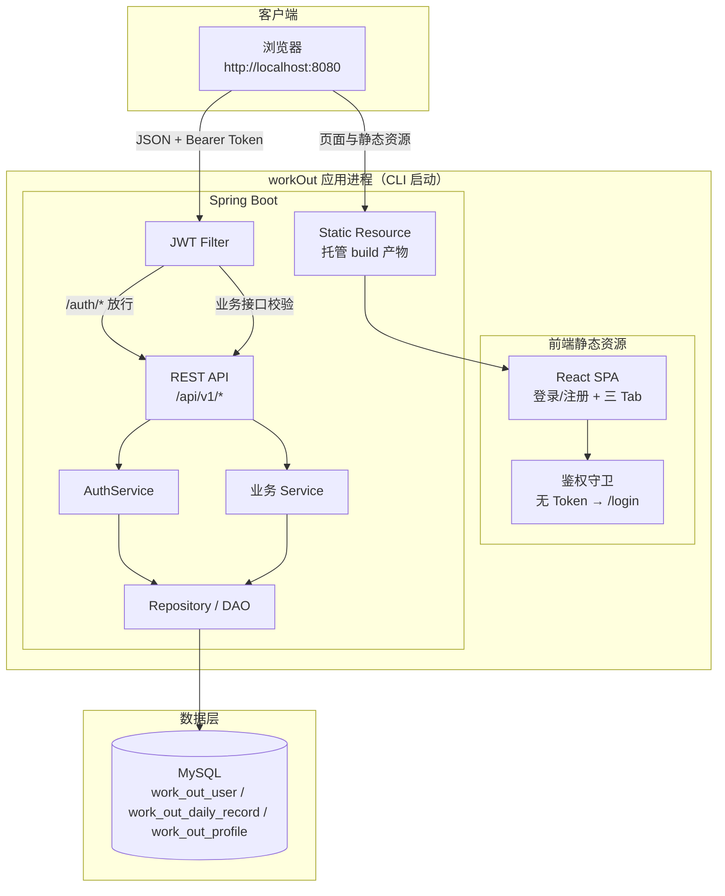

### 1.1 分层说明

| 层 | 职责 |
| --- | --- |
| 浏览器 / React | 登录注册页、三 Tab SPA、鉴权守卫、本地存 Token、颜色语义、触发下载 |
| Spring Boot 静态托管 | 托管前端 `build` 产物，统一入口端口 |
| JWT Filter | 解析 `Authorization: Bearer`；业务接口无/无效 Token → 401；`/api/v1/auth/**` 放行 |
| API | `/api/v1/...`，统一响应 `{ code, msg, data }`，携带 `requestId`、`timestamp` |
| AuthService | 注册（哈希密码）、登录发 Token |
| 业务 Service | 从 SecurityContext / Token 取 userId；按用户过滤查询与写入 |
| MySQL | `work_out_user`、`work_out_daily_record`、`work_out_profile` 持久化（Flyway history 表不改名前缀） |

后端包按模块分层（`com.workout`）：

| 包 | 边界 |
| --- | --- |
| `config/` | Security、JWT 配置、SPA 回退、全局异常处理 |
| `common/` | `ApiResponse` / `ApiRequest`、业务/未授权异常、健康检查 |
| `modules.auth.api` | Auth Controller 与 DTO；`CurrentUser` 只读 JWT |
| `modules.auth.application` | `AuthService` 编排 |
| `modules.auth.domain` | `AuthPrincipal` |
| `modules.auth.infrastructure` | `UserEntity`/`UserRepository`、`JwtService`、`JwtAuthFilter` |
| `modules.record.*` | 日记录 + xlsx 导出（api / application / domain / infrastructure） |
| `modules.profile.*` | 个人资料与身体历史（api / application / infrastructure） |
| `modules.share.*` | 分享创建与公开报告（api / application / infrastructure） |
| `bootstrap` | 非 test profile 演示种子（demo 账号） |

业务 `userId` 只从 JWT 进入应用服务，禁止信任客户端传入身份。

### 1.2 部署与启动形态

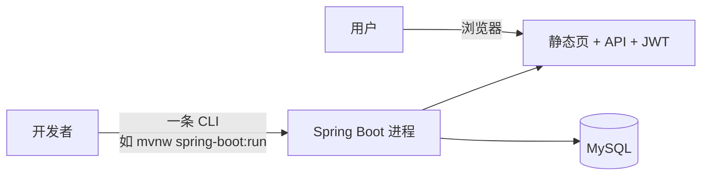

---

## 2. 前端信息架构（模块视图）

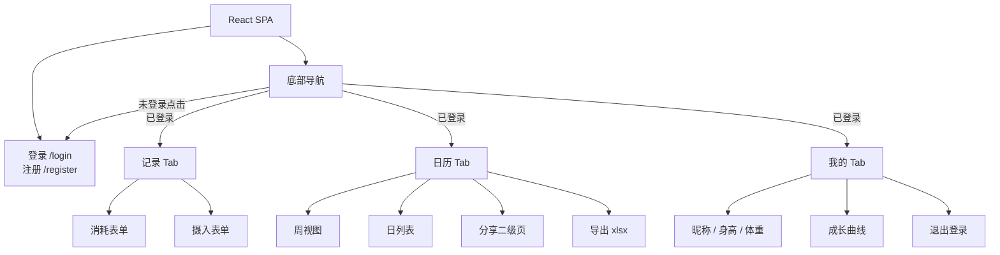

---

## 3. 后端模块与数据对象

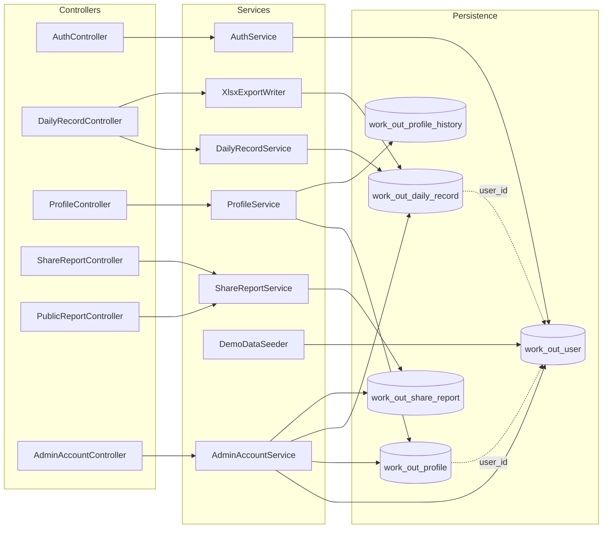

| 对象 | 关键字段 |
| --- | --- |
| User | id, username, email(可空唯一), passwordHash, createdAt |
| DailyRecord | id, **userId**, type(`CONSUME`/`INTAKE`), content, recordedAt, createdAt |
| Profile | id, **userId**（唯一）, nickname, heightCm, weightKg, updatedAt |
| ProfileHistory | id, **userId**, changedAt, nickname, heightCm, weightKg |
| ShareReport | id, token, **userId**, rangeFrom, rangeTo, snapshotJson |

---

## 4. 接口一览（与架构对应）

| 能力 | 方法 | 路径 | 鉴权 |
| --- | --- | --- | --- |
| 注册 | POST | `/api/v1/auth/register` | 公开 |
| 登录 | POST | `/api/v1/auth/login` | 公开 |
| 邮箱登录 | POST | `/api/v1/auth/loginByEmail` | 公开 |
| 当前用户 | GET | `/api/v1/auth/me` | JWT |
| 发邮箱验证码 | POST | `/api/v1/auth/email/sendCode` | LOGIN 公开；BIND/UNBIND 须 JWT |
| 绑定邮箱 | POST | `/api/v1/auth/email/bind` | JWT |
| 解绑邮箱 | POST | `/api/v1/auth/email/unbind` | JWT |
| 新增记录 | POST | `/api/v1/dailyRecords` | JWT |
| 按日查询 | GET | `/api/v1/dailyRecords?date=yyyy-MM-dd` | JWT |
| 导出 xlsx | GET | `/api/v1/dailyRecords/exportCsv?date=`（或 yearMonth / from+to） | JWT |
| 创建分享 | POST | `/api/v1/shareReports`（筛选参数同上） | JWT；落库后异步 AI，不阻塞 |
| 本人分享列表 | GET | `/api/v1/shareReports` | JWT |
| 公开报告 | GET | `/api/v1/reports/{id}` | 公开；含 advice + adviceStatus；就绪建议为 Markdown |
| 查询资料 | GET | `/api/v1/profile` | JWT |
| 保存资料 | PUT | `/api/v1/profile` | JWT |
| CMS 账户列表 | GET | `/api/v1/admin/accounts` | ADMIN JWT |
| CMS 用户详情 | GET | `/api/v1/admin/accounts/{userId}` | ADMIN JWT |
| CMS 已有分享 | GET | `/api/v1/admin/reports` | ADMIN JWT |
| CMS API Key 列表 | GET | `/api/v1/admin/apiKeys` | ADMIN JWT |
| CMS 密钥库列表 | GET | `/api/v1/admin/apiKeys/pool` | ADMIN JWT；仅掩码 |
| CMS 密钥库新增 | POST | `/api/v1/admin/apiKeys/pool` | ADMIN JWT；入库后新注册可默认分配 |
| CMS 单用户改 Key | PUT | `/api/v1/admin/apiKeys/{userId}` | ADMIN JWT |
| CMS 批量改 Key | PUT | `/api/v1/admin/apiKeys/batch` | ADMIN JWT |
| CMS AI 调用 | GET | `/api/v1/admin/aiCalls?userId=&apiKeyId=` | ADMIN JWT |

---

## 5. 技术流程图

### 5.0 未登录跳转与登录发 Token

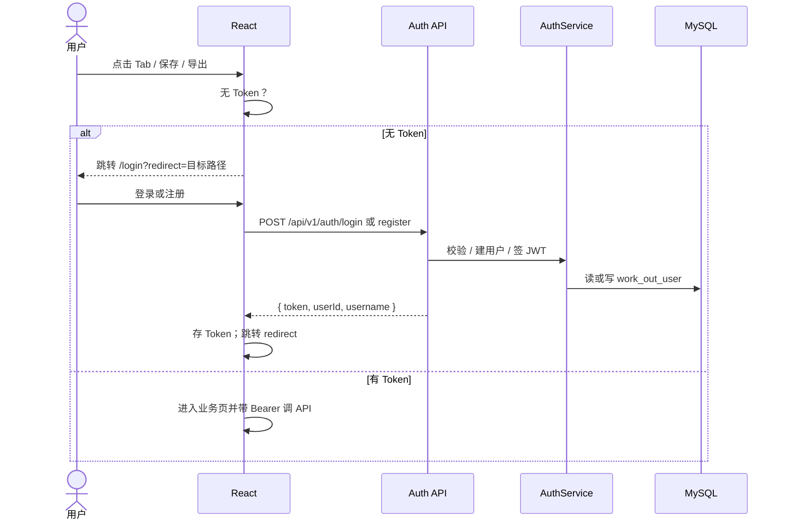

### 5.1 新增消耗 / 摄入记录

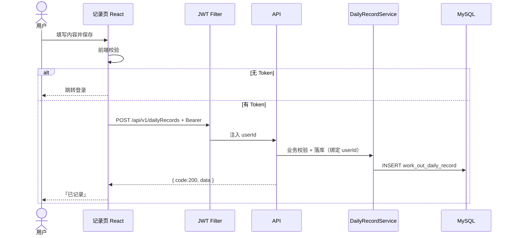

### 5.2 日历按日回看

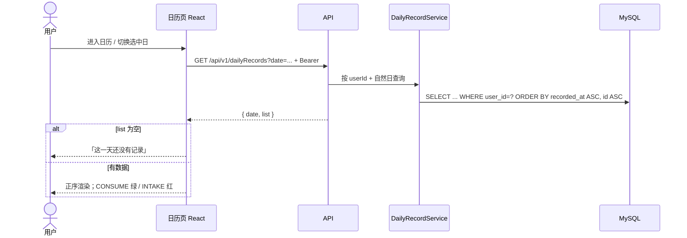

### 5.3 按筛选导出 xlsx

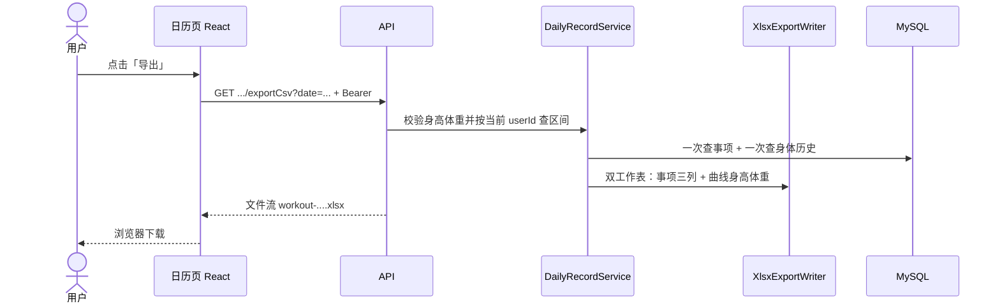

分享走日历二级页 `/calendar/share`，再 `POST /api/v1/shareReports`，不在日历主页内联贴链接。

### 5.4 保存个人资料

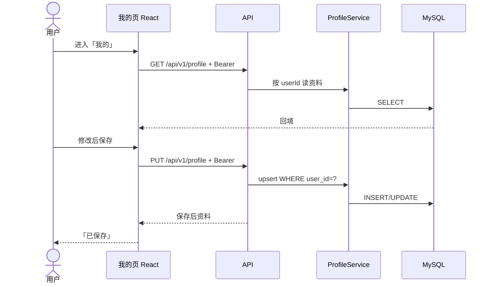

### 5.5 CLI 启动与访问闭环

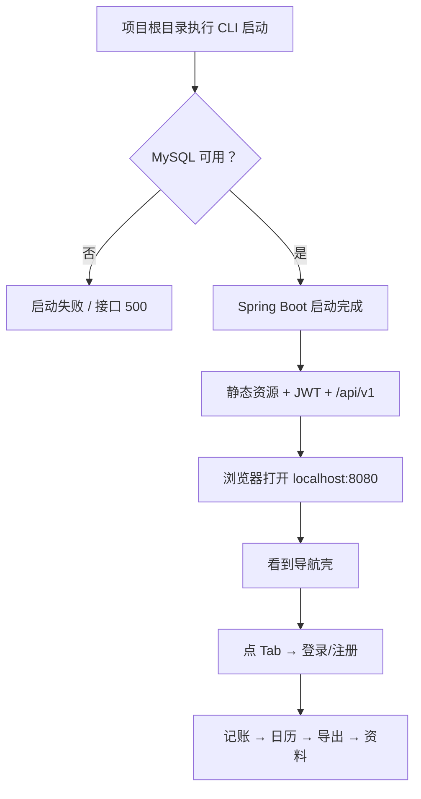

### 5.6 端到端业务主路径（产品视角）

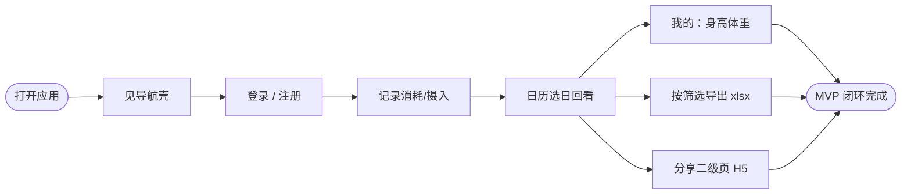

---

## 6. 关键设计约束（实现时遵守）

| 约束 | 说明 |
| --- | --- |
| 多账号隔离 | 所有业务读写必须带当前 `userId`；禁止客户端传 userId 覆盖 |
| 鉴权 | JWT；公开 `/api/v1/auth/register|login`、`/api/v1/health`、`/api/v1/reports/**`；业务 401 |
| 演示种子 | 非 test profile 启动时若无 `demo` 用户则写入约 ±90 天数据；`saveAll` 批量，禁止 N+1 |
| 密码 | 仅存哈希；错误登录统一文案 |
| 时区 | 默认 `Asia/Shanghai`；自然日按本地时区切分 |
| 本期写策略 | 记录只新增，不改不删 |
| 颜色语义 | 消耗绿 `#16A34A`，摄入红 `#DC2626` |
| 响应格式 | `{ code, msg, data }`；校验失败 400；未鉴权 401 |
| 部署 | 前后端不分离，不以微服务拆分为验收目标 |

---

## 7. 与产品 / 功能文档的对应

| 本文章节 | 对应文档 |
| --- | --- |
| §1～§3 架构（含 JWT） | 产品文档 §3、§7；功能文档 §3、§8、§9 |
| §4 接口 | 功能文档 §8 |
| §5.0 登录跳转 | 产品文档 §4.0；功能文档 §3 |
| §5.1 记账流程 | 功能文档 §4；产品文档 §4.1 |
| §5.2～5.3 日历与导出 | 功能文档 §5；产品文档 §4.2 |
| §5.4 资料 | 功能文档 §6；产品文档 §4.3 |
| §5.5 启动 | 功能文档 §9 |
| CMS | 功能文档 §6.4、§8.9～8.11；产品文档 §4.4 |
| AI 建议 / 向量化 | [workOut-AI方案.md](./workOut-AI方案.md)；[workOut-上下文工程.md](./workOut-上下文工程.md) |
